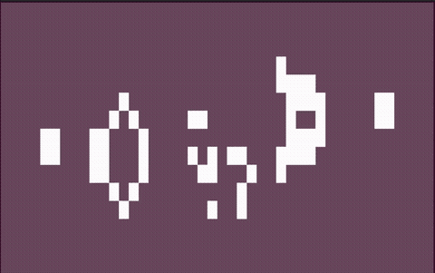

# Pylife

This is a test playground intended for exploration of Python language features and external tools. Breaking changes are not a concern.

## Usage

```bash
# Clone and cd to the repo
git clone git@github.com:condekind/pylife.git && cd pylife

# From inside the project root, create a python 3.11+ virtualenv, e.g.:
# python -m venv .venv
#   or, if already created, activate it:
# source .venv/bin/activate

# Run using provided input
python python-game-of-life -i input/input03.txt
```

Example of a [Gosper glider gun](https://en.wikipedia.org/wiki/Gun_(cellular_automaton)):



Some stats are printed on termination (`ctrl+C`):
```
^CINFO:root:
Running time: 4.7897047996521 seconds
CacheInfo(hits=123047, misses=349, maxsize=1024, currsize=349)
```

## Todo:

Some of the listed items might be overkill for the time being, but this repo might also serve as a future python template

- [x] mypy / lsp / lints / fix types (!!!)
- [x] argparse
- [x] pyproject.toml
- [x] CI
- [ ] Tests
